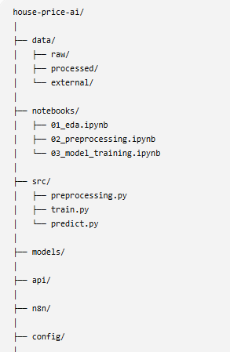

***Thực hành n8n sau khi học xong lý thuyết về n8n***
- Luồng xử lý dự tính: Nhận dữ liệu từ ggsheet -> n8n (webhook) -> python xử lý dữ liệu -> giá nhà dự đoán -> mai vẽ

  Ngày 1: Làm quen fastapi + tạo dữ liệu mẫu:
  

cấu trúc thư mục:
